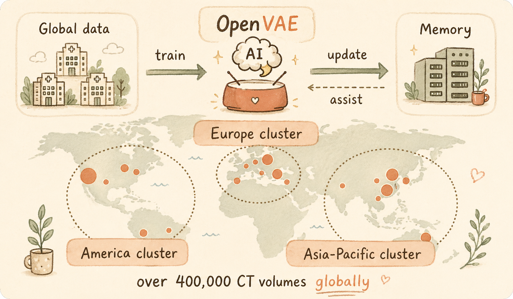

# OpenVAE

Open-source VAE family for medical imaging. Pretrained latent backbones for CT/MRI diffusion models.

2D and 3D autoencoders trained on up to 1M CT volumes with perceptual, adversarial, and segmentation-guided objectives.



## Release timeline

- **Mar 15, 2026** — 2D OpenVAE weights uploaded to Hugging Face.
- **Apr 6, 2026** — First 3D 64³ patch checkpoint uploaded (`OpenVAE-3D-4x-patch64-10K`).

## Models and CT reconstruction benchmark

Reconstruction metrics on the OpenVAE CT hold-out benchmark (12 cases); **SSIM** and **PSNR** are higher-is-better, **LPIPS** is lower-is-better.

| Model | Type | Patients | Latent | Resolution | SSIM | PSNR (dB) | LPIPS |
| --- | --- | --- | --- | --- | --- | --- | --- |
| [stable-diffusion-v1-5](https://huggingface.co/stable-diffusion-v1-5/stable-diffusion-v1-5) | KL-VAE | 0 | 8× | 512² RGB | N/A | N/A | N/A |
| [stable-diffusion-3.5-large](https://huggingface.co/stabilityai/stable-diffusion-3.5-large) | KL-VAE | 0 | 8× | — | N/A | N/A | N/A |
| [MAISI](https://huggingface.co/MONAI/maisi_ct_generative) | KL-VAE | 0 | 4× | 64³ | — | — | — |
| `OpenVAE-2D-4x-2K` | KL-VAE | 2K | 4× | 512² | 0.8932 | 34.87 | 0.0868 |
| `OpenVAE-2D-4x-10K` | KL-VAE | 10K | 4× | 512² | 0.8867 | 34.91 | 0.0816 |
| `OpenVAE-2D-4x-10K-pro` | KL-VAE | 10K | 4× | 512² | 0.8880 | 34.51 | 0.0781 |
| `OpenVAE-2D-4x-20K` | KL-VAE | 20K | 4× | 512² | 0.8798 | 34.63 | 0.0782 |
| `OpenVAE-2D-4x-100K` | KL-VAE | 100K | 4× | 512² | 0.8835 | 34.24 | 0.0752 |
| `OpenVAE-2D-4x-300K` | KL-VAE | 300K | 4× | 512² | 0.8874 | 33.84 | 0.0852 |
| `OpenVAE-2D-4x-PCCT_enhanced` | KL-VAE | 300K | 4× | 512² | 0.8813 | 34.00 | 0.0756 |
| `OpenVAE-3D-4x-patch64-10K` | KL-VAE | 10K | 4× | 64³ | 0.8099 | 25.99 | 0.1565 |
| `OpenVAE-3D-4x-20K` | KL-VAE | 20K | 4× | 64³ | — | — | — |
| `OpenVAE-3D-4x-20K` | KL-VAE | 20K | 4× | 128³ | — | — | — |
| `OpenVAE-3D-4x-100K` | KL-VAE | 100K | 4× | 128³ | — | — | — |
| `OpenVAE-3D-4x-1M` | KL-VAE | 1M | 4× | 128³ | — | — | — |
| `OpenVAE-3D-4x-100K-VQ` | VQ-VAE | 100K | 4× | 64³ | — | — | — |
| `OpenVAE-3D-8x-100K-VQ` | VQ-VAE | 100K | 8× | 64³ | — | — | — |

**N/A** — general-domain VAE; not evaluated on the medical CT benchmark above. **—** — checkpoint listed for distribution; benchmark row not run in the current `summary.csv`.

**Pretrained weights:** [huggingface.co/SMILE-project/OpenVAE](https://huggingface.co/SMILE-project/OpenVAE)

<details>
<summary><b>Quick Start</b> (2D Diffusers / 3D MONAI)</summary>

### 2D VAE (Diffusers)

```python
import torch
from diffusers import AutoencoderKL

vae = AutoencoderKL.from_pretrained(
    "SMILE-project/OpenVAE", subfolder="vae"
).to("cuda").eval()

x = torch.randn(1, 3, 512, 512, device="cuda")
with torch.no_grad():
    z = vae.encode(x).latent_dist.sample()   # (1, 4, 128, 128)
    x_hat = vae.decode(z).sample              # (1, 3, 512, 512)
```

### 3D VAE (MONAI)

```python
import torch
from monai.apps.generation.maisi.networks.autoencoderkl_maisi import AutoencoderKlMaisi

model = AutoencoderKlMaisi(
    spatial_dims=3, in_channels=1, out_channels=1,
    num_channels=(64, 128, 256), latent_channels=4,
    num_res_blocks=(2, 2, 2), norm_num_groups=32,
    attention_levels=(False, False, False),
)
model.load_state_dict(torch.load("ckpt/OpenVAE-3D-4x-100K/autoencoder_best.pt"))
model.eval().to("cuda")

x = torch.randn(1, 1, 64, 64, 64, device="cuda")
with torch.no_grad():
    z, _, _ = model.encode(x)   # (1, 4, 16, 16, 16)
    x_hat = model.decode(z)     # (1, 1, 64, 64, 64)
```

### CT reconstruction

```bash
# 2D slice-by-slice
python src/demo_medvae.py --input scan.nii.gz --checkpoint ckpt/OpenVAE-2D-4x-100K

# 3D sliding-window (example: 100K checkpoint; use OpenVAE-3D-4x-patch64-10K path for the 10K 64³ model)
python test/test_3dvae.py --input scan.nii.gz --checkpoint ckpt/OpenVAE-3D-4x-100K/autoencoder_best.pt
```

</details>

<details>
<summary><b>Training</b></summary>

```bash
# 2D KL-VAE (multi-GPU, Accelerate)
accelerate launch src/train_klvae.py \
    --train_data_dir /data/AbdomenAtlasPro \
    --output_dir outputs/klvae \
    --resolution 512 \
    --train_batch_size 8 \
    --learning_rate 1e-4

# 3D VAE (single GPU, patch-based)
python src/train_3dvae.py \
    --train_data_dir /data/AbdomenAtlasPro \
    --patch_size 64 64 64 \
    --num_epochs 100 \
    --amp

# 3D VAE from NIfTI volumes (ct.nii.gz or ct.nii per subject folder)
python src/train_3dvae.py \
    --train_data_dir /data/AbdomenAtlasPro \
    --use-nifti \
    --patch_size 64 64 64 \
    --num_epochs 100 \
    --amp
```

**Data format:**

- **HDF5 (default):** `train_data_dir/<subject_id>/ct.h5` — key `"image"`, shape `(H, W, D)`, HU in `[-1000, 1000]`.
- **NIfTI (`--use-nifti`):** `train_data_dir/<subject_id>/ct.nii.gz` or `ct.nii` — same HU range and shape convention `(H, W, D)`; requires [nibabel](https://nipy.org/nibabel/).

</details>

<details>
<summary><b>Benchmark scripts</b></summary>

```bash
# Run reconstruction on all models
bash test/benchmark.sh /path/to/ct_dir

# Recompute metrics (no re-inference)
python test/direct_compute_metrics.py --benchmark_root outputs/vae_benchmark --skip-lpips

# Plot
python test/plot_benchmark_metrics.py
```

</details>

<details>
<summary><b>Metric definitions</b> (MAE / Detail / SSIM / PSNR / LPIPS)</summary>

| Metric | Scale | Direction | Description |
| --- | --- | --- | --- |
| MAE_100 | 0–100 | higher = better | `(1 - MAE) * 100` on 3D volumes in [0,1] |
| Detail_100 | 0–100 | higher = better | Pearson corr of 3D gradient magnitudes |
| SSIM | 0–1 | higher = better | Structural similarity |
| PSNR | dB | higher = better | Peak signal-to-noise ratio |
| LPIPS | 0–1 | lower = better | Learned perceptual similarity (AlexNet) |

Full per-metric dumps (including MAE_100 and Detail_100) live in `outputs/vae_benchmark/summary.csv`.

</details>

<details>
<summary><b>Upload checkpoints to Hugging Face</b></summary>

After `hf auth login` (token with write access to `SMILE-project/OpenVAE`):

```bash
bash scripts/upload_hf_checkpoints.sh
```

This uploads `MAISI/maisi_autoencoder.pt` and `OpenVAE-3D-4x-patch64-10K/autoencoder_best.pt` (and `autoencoder_latest.pt`). To refresh the Hub model card, upload `README.md`:

```bash
hf upload SMILE-project/OpenVAE README.md README.md \
  --commit-message "docs: merged models + benchmark table and timeline"
```

</details>

<details>
<summary><b>Project structure</b></summary>

```
OpenVAE/
├── scripts/
│   └── upload_hf_checkpoints.sh  # Push MAISI + 3D patch64-10K to Hugging Face Hub
├── src/
│   ├── train_klvae.py            # 2D KL-VAE training (Diffusers + Accelerate)
│   ├── train_3dvae.py            # 3D VAE training (MONAI MAISI)
│   ├── demo_medvae.py            # 2D inference demo
│   ├── utils_loss.py             # Segmentation + GAN loss utilities
│   ├── utils_discriminator.py    # PatchGAN / StyleGAN discriminators
│   ├── MIRA2D/                   # 2D SR / enhancement reference code
│   └── MIRA3D/                   # 3D SR (MONAI)
├── test/
│   ├── benchmark_vae.py          # Full benchmark (inference + metrics)
│   ├── direct_compute_metrics.py # Metrics-only recomputation
│   ├── plot_benchmark_metrics.py # Visualization
│   ├── test_2dvae.py             # 2D VAE inference
│   └── test_3dvae.py             # 3D VAE inference (sliding-window)
└── ckpt/                         # Model checkpoints (download from HF)
```

</details>

<details>
<summary><b>Citation</b></summary>

```bibtex
@article{liu2025see,
  title={See More, Change Less: Anatomy-Aware Diffusion for Contrast Enhancement},
  author={Liu, Junqi and Wu, Zejun and Bassi, Pedro RAS and Zhou, Xinze and Li, Wenxuan and Hamamci, Ibrahim E and Er, Sezgin and Lin, Tianyu and Luo, Yi and P{\l}otka, Szymon and others},
  journal={arXiv preprint arXiv:2512.07251},
  year={2025}
}
```

</details>

## License

MIT
